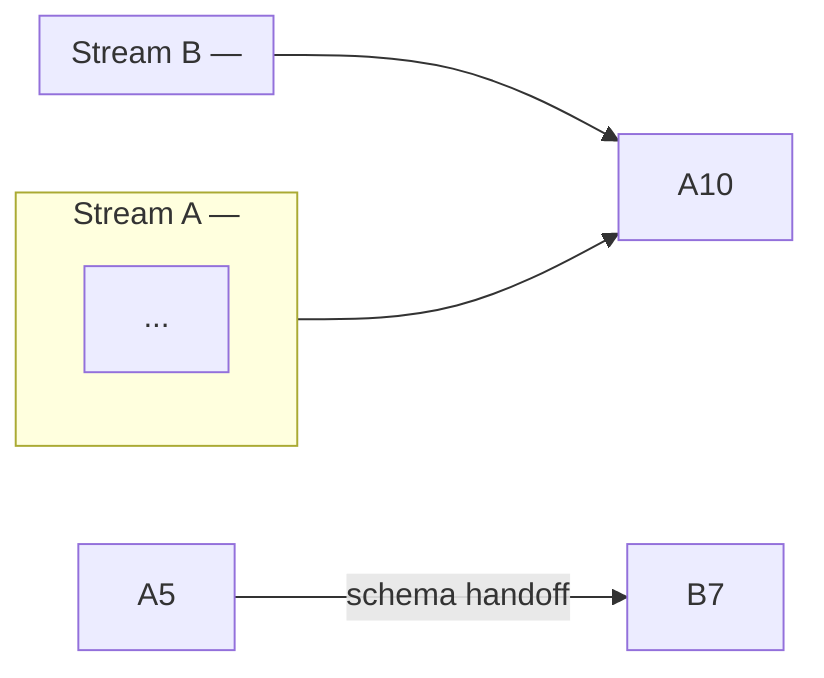

# To Stories

Turn a PRD and execution plan into a single `plan/STORIES.md` of layered technical stories. Synthesize from the existing documents; do NOT re-interview the user or re-derive requirements.

## Source documents

Read all of these before writing a single story:

1. `PRD.md` — must-build IDs (BE-*, FE-*, DF-*), acceptance criteria, key decisions, and scope boundaries.
2. `plan/PLAN.md` — phase index, source baseline, required repository changes, and stream assignments.
3. `plan/02-phases-and-gates.md` — phase steps, dependency order, and stakeholder gates. Read if present; note the omission and derive ordering from `plan/PLAN.md` if absent.
4. `plan/01-decisions-and-risks.md` — agreed decisions and risks that constrain implementation. Read if present; skip and note the omission if absent.
5. `plan/04-traceability.md` — ID-to-phase mapping; confirms no must-build ID is dropped. Read if present; perform the traceability check manually from `PRD.md` if absent.
6. `CONTEXT.md` — canonical project acronym, naming conventions, and domain terms. Read if present; ask the user for the project acronym if absent.

## Layers

Every story belongs to exactly one layer. Assign by where the heaviest change sits:

| Tag | Owns |
|---|---|
| `[BE]` | GraphQL schema contract, type definitions, authorization rules, feature-flag gate setup. No data fetching. |
| `[DF]` | SQL resolvers, jOOQ queries, dbt projections, fact reads. All database access. Each story ships a `queries.sql` mirror. |
| `[FE]` | UI components, GraphQL operations, feature-flag evaluation, Amplitude instrumentation. Each story ships privacy-safe Amplitude events. |
| `[Other]` | Cross-cutting steps that unblock multiple layers — schema package publication, frontend codegen regeneration. |

## Wide refactors

A **wide refactor** is a single mechanical change (rename a column, retype a shared symbol) whose blast radius fans across the whole codebase — no vertical slice can land green while it is in flight. Do not force it into a feature story. Sequence it as **expand–contract**:

1. **Expand** — add the new form alongside the old so nothing breaks. One story, no blockers from feature work.
2. **Migrate** — move call sites in batches sized by blast radius (per package, per directory), each batch its own story blocked by the expand, keeping CI green batch to batch because the old form still exists.
3. **Contract** — delete the old form once no caller remains, in a story blocked by every migrate batch.

When even the batches cannot stay green independently, let them share an integration branch and block a final integrate-and-verify story; green is promised only there. Always sequence expand–contract stories before the feature stories that depend on the result.

## Story ID convention

`[<ACRONYM>-<NN>]` — acronym from `CONTEXT.md`, zero-padded sequence number in dependency order (blockers first). IDs are stable once assigned; never renumber.

## Story shape

Each story follows this exact structure — no extra sections, no reordering, no testing section:

```markdown
### [<ID>] <Layer tag> - <Short imperative title>

**Phase:** <N>
**Depends on:** <ID list, or "None (can start immediately)">
**Feature flag:** `<flag key>`  ← include only when this story introduces or gates on a flag

#### Technical story

As <role>, <what they can do or see as a result of this story>.

#### Acceptance criteria

- <Checkable, observable criterion.>

#### Out of scope

- <Adjacent work this story does not do, with the story ID that owns it.>
```

Rules:
- **Technical story**: one sentence, "As … <verb>" form. Names the end-to-end capability, not the implementation.
- **Acceptance criteria**: checkable and exhaustive for this story's layer. Each criterion must be falsifiable.
- **Out of scope**: names adjacent work a reader might expect here but that belongs elsewhere, with its owning story ID. Omit only when nothing adjacent could be confused.
- **No testing section.** Never add one.
- The `Other` section (`[DEMO-05]`, `[DEMO-12]`-style schema publish stories) has no `Out of scope` when there is nothing adjacent to clarify.

## Process

### 1. Read all source documents

Read every source document listed above in full before drafting.

### 2. Enumerate must-build IDs

List every must-build ID from `PRD.md`. Cross-check against `plan/04-traceability.md`. A story must exist for every ID; a dropped ID is a defect.

### 3. Check for prefactors and wide refactors

Before assigning story IDs, scan the codebase for changes that must precede feature work:

- **Prefactor**: a contained cleanup or restructure that makes the feature change straightforward. Sequence it first; give it its own story blocked by nothing. "Make the change easy, then make the easy change."
- **Wide refactor**: a change with a blast radius across the whole codebase (see Wide refactors above). Sequence as expand–contract stories before the feature stories that depend on them.

If neither applies, proceed. Do not invent prefactor work absent from the code.

### 4. Assign layers and sequence

For each ID decide its layer. Derive dependency order from `plan/02-phases-and-gates.md`. Assign story IDs in dependency order — blockers get lower numbers.

### 5. Derive backlog rules

Extract the invariants that apply to every story from the PRD's decisions and the plan's constraints. These become the **Backlog rules** section. Examples from a real run:

- Company-scoping requirement on all resolvers and queries.
- List bounding (default, max) and deterministic ordering.
- Feature flag gate behaviour (frontend mount, backend pre-SQL rejection).
- Fact source and score guard rules per layer.
- Isolation constraint (no widening of existing roots or shared responses).

### 6. Build the dependency and stream diagrams

Derive two mermaid diagrams from `plan/02-phases-and-gates.md` and `plan/PLAN.md`:

1. **Dependency graph** (`flowchart TD`) — subgraphs by layer and phase, edges between stories, stakeholder gate edges between phases.
2. **Stream diagram** (`flowchart LR`) — subgraphs by developer stream, schema handoff edges between streams, gate edge to Phase 2.

### 7. Draft stories

Write every story using the shape above. For each:
- Pull acceptance criteria directly from the PRD's must-build list and AC table; do not invent requirements.
- Pull out-of-scope boundaries from the PRD's Out of scope section and adjacent story assignments.
- Name the feature flag only when that story introduces or is gated by one.

### 8. Quiz the user

Present the proposed story breakdown as a numbered list before writing the file. For each story show:

- **ID and title**
- **Blocked by**: which stories must complete first, or "None"
- **What it delivers**: the end-to-end capability this story makes work

Ask the user:
- Does the granularity feel right? (too coarse / too fine)
- Are the blocking edges correct — does each story only depend on stories that genuinely gate it?
- Should any stories be merged or split?

Iterate until the user approves the breakdown. Only then proceed to step 9.

### 9. Write plan/STORIES.md

Write the single output file using the exact template below. Overwrite if the file already exists.

## Output template

Mirror this structure exactly — headings, separators, table columns, icon legend, section order.

````markdown
# [<ACRONYM>] <Project name> — Technical Stories

**Status:** Draft — pending Jira creation
**Repositories:** `<repo-1>`, `<repo-2>`
**Source plan:** [`PLAN.md`](./PLAN.md) · **PRD:** [`PRD.md`](./PRD.md)

---

## Layers

| Layer | Responsibility |
|---|---|
| `[BE]` | GraphQL schema contract, type definitions, authorization rules, and feature-flag gate setup. No data fetching. |
| `[DF]` | SQL resolvers, jOOQ queries, dbt projections, and fact reads. Owns all database access. Each story ships a `queries.sql` mirror. |
| `[FE]` | UI components, GraphQL operations, feature-flag evaluation, and Amplitude instrumentation. Each story ships privacy-safe Amplitude events. |
| `[Other]` | Cross-cutting steps that unblock multiple layers — schema package publication and frontend codegen regeneration. |

---

## Backlog rules

- <Invariant 1 derived from PRD decisions.>
- <Invariant 2.>

---

## Dependency graph

```mermaid
flowchart TD
    subgraph BE[Backend — <repo>]
        <ID>[<ID> BE <title>]
    end
    subgraph DF[DataFetcher — <repo>]
        ...
    end
    subgraph S1[Other]
        ...
    end
    subgraph FE[Frontend — <repo>]
        ...
    end
    FE & DF & BE -->|<gate name>| P2
    subgraph P2_DF[DataFetcher — Phase 2]
        ...
    end
    subgraph P2_S[Other — Phase 2]
        ...
    end
    subgraph P2_FE[Frontend — Phase 2]
        ...
    end
```

---

## Streams

<One sentence describing parallel stream count and coordination points.>

| Stream | Developer | Stories | Owns |
|---|---|---|---|
| **A — <name>** | Dev A | <ID list> | <what stream A owns> |
| **B — <name>** | Dev B | <ID list> | <what stream B owns> |

**Handoff points:**
- **<ID>** (Dev A) → unblocks <IDs> (Dev B). <One sentence on what Dev B does while waiting.>



---

## Story index

| Icon | Status |
|---|---|
| ⬜ | To Do |
| 🔵 | In Progress |
| 🟡 | In Review |
| ✅ | Done |

| Status | Story | Stream | Layer | Phase | Depends on | Summary |
|---|---|---|---|---|---|---|
| ⬜ To Do | <ID> | <Stream> | <Layer> | <Phase> | <Deps or None> | [<ID>] <Layer tag> - <title> |

## Backend `[BE]`

---

### [<ID>] BE - <title>

**Phase:** <N>
**Depends on:** None (can start immediately)
**Feature flag:** `<key>`

#### Technical story

As <role>, <capability>.

#### Acceptance criteria

- <criterion>

#### Out of scope

- <adjacent work> (<owning ID>).

---

## DataFetcher `[DF]`

---

### [<ID>] DF - <title>

...

---

## Other `[Other]`

---

### [<ID>] Other - <title>

...

---

## Frontend `[FE]`

---

### [<ID>] FE - <title>

...
````

## Traceability check

Before writing the file verify:
- Every must-build ID from `PRD.md` appears in at least one story's acceptance criteria.
- Every `Depends on` value references a real story ID defined in this file or a named stakeholder gate from `plan/02-phases-and-gates.md`.
- No story introduces scope absent from `PRD.md`.

Report any gap; do not silently drop an ID.
